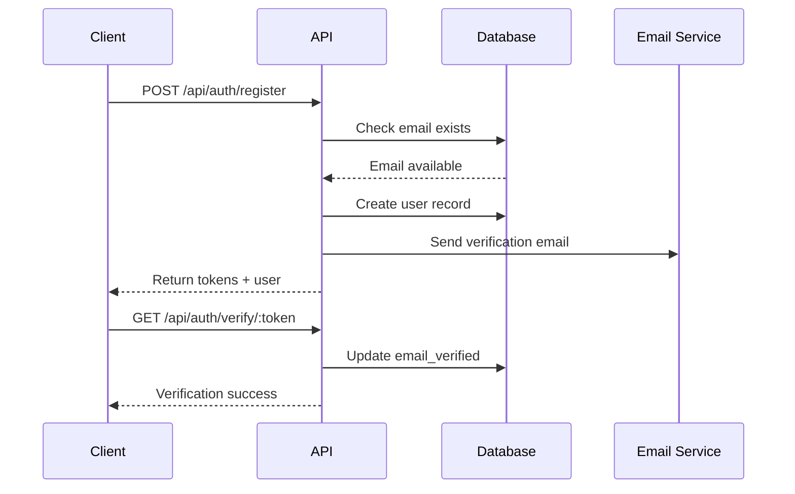
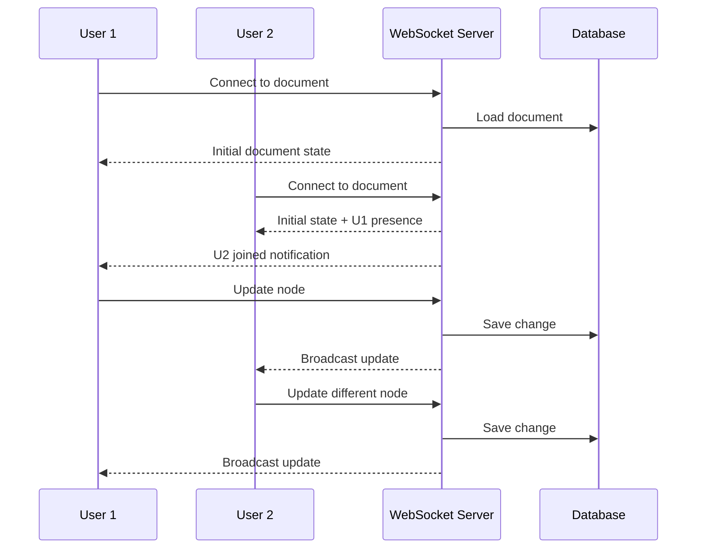
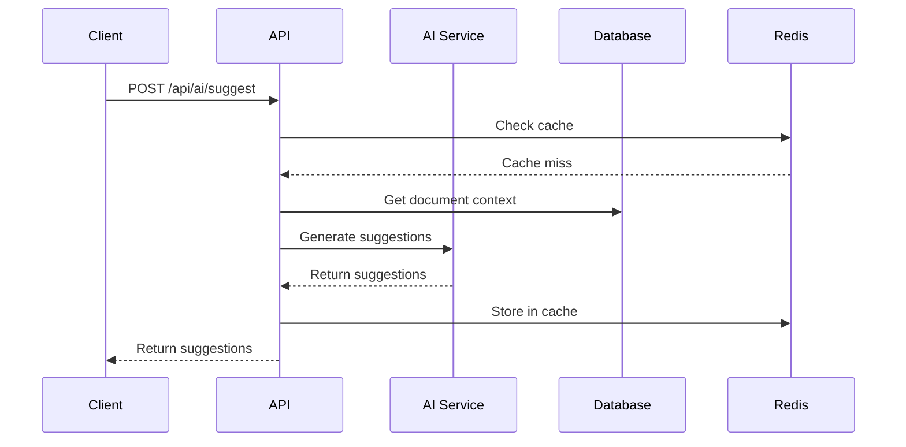
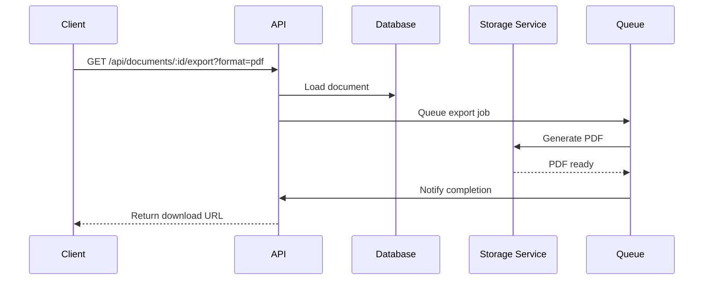

# BrainFlowy Backend Requirements Document

## 1. Overview

This document defines the backend requirements for BrainFlowy, an intelligent mind-mapping and outlining application focused on flow state productivity. The backend must support real-time collaboration, AI-powered features, and seamless synchronization across devices.

## 2. API Endpoints

### 2.1 Authentication Endpoints

#### POST /api/auth/register
**Description**: Register a new user account
```json
Request:
{
  "email": "string",
  "password": "string",
  "displayName": "string"
}

Response (201):
{
  "user": {
    "id": "uuid",
    "email": "string",
    "displayName": "string",
    "createdAt": "timestamp"
  },
  "accessToken": "jwt_token",
  "refreshToken": "jwt_token"
}
```

#### POST /api/auth/login
**Description**: Authenticate user and receive tokens
```json
Request:
{
  "email": "string",
  "password": "string"
}

Response (200):
{
  "user": {
    "id": "uuid",
    "email": "string",
    "displayName": "string"
  },
  "accessToken": "jwt_token",
  "refreshToken": "jwt_token"
}
```

#### POST /api/auth/refresh
**Description**: Refresh access token using refresh token
```json
Request:
{
  "refreshToken": "jwt_token"
}

Response (200):
{
  "accessToken": "jwt_token",
  "refreshToken": "jwt_token"
}
```

#### POST /api/auth/logout
**Description**: Invalidate refresh token
```json
Request:
Headers: Authorization: Bearer <access_token>

Response (204): No Content
```

### 2.2 User Management Endpoints

#### GET /api/users/profile
**Description**: Get current user profile
```json
Response (200):
{
  "id": "uuid",
  "email": "string",
  "displayName": "string",
  "preferences": {
    "theme": "light|dark",
    "defaultView": "mindmap|outline",
    "aiAssistEnabled": "boolean"
  },
  "createdAt": "timestamp",
  "updatedAt": "timestamp"
}
```

#### PATCH /api/users/profile
**Description**: Update user profile
```json
Request:
{
  "displayName": "string",
  "preferences": {
    "theme": "light|dark",
    "defaultView": "mindmap|outline",
    "aiAssistEnabled": "boolean"
  }
}

Response (200): Updated user object
```

### 2.3 Document Management Endpoints

#### GET /api/documents
**Description**: List user's documents
```json
Query Parameters:
- page: number (default: 1)
- limit: number (default: 20)
- sort: string (createdAt|updatedAt|title)
- order: string (asc|desc)
- search: string (optional)

Response (200):
{
  "documents": [
    {
      "id": "uuid",
      "title": "string",
      "type": "mindmap|outline",
      "lastModified": "timestamp",
      "isShared": "boolean",
      "collaborators": ["userId1", "userId2"],
      "tags": ["string"]
    }
  ],
  "pagination": {
    "page": "number",
    "limit": "number",
    "total": "number",
    "totalPages": "number"
  }
}
```

#### POST /api/documents
**Description**: Create new document
```json
Request:
{
  "title": "string",
  "type": "mindmap|outline",
  "content": {
    "nodes": [],
    "connections": []
  },
  "tags": ["string"]
}

Response (201):
{
  "id": "uuid",
  "title": "string",
  "type": "mindmap|outline",
  "content": {},
  "createdAt": "timestamp",
  "updatedAt": "timestamp"
}
```

#### GET /api/documents/:id
**Description**: Get specific document
```json
Response (200):
{
  "id": "uuid",
  "title": "string",
  "type": "mindmap|outline",
  "content": {
    "nodes": [
      {
        "id": "string",
        "text": "string",
        "position": { "x": "number", "y": "number" },
        "children": ["nodeId"],
        "metadata": {}
      }
    ],
    "connections": [
      {
        "source": "nodeId",
        "target": "nodeId",
        "type": "string"
      }
    ]
  },
  "collaborators": [],
  "version": "number",
  "createdAt": "timestamp",
  "updatedAt": "timestamp"
}
```

#### PUT /api/documents/:id
**Description**: Update document
```json
Request:
{
  "title": "string",
  "content": {},
  "tags": ["string"]
}

Response (200): Updated document object
```

#### DELETE /api/documents/:id
**Description**: Delete document
```json
Response (204): No Content
```

### 2.4 Real-time Collaboration Endpoints

#### WebSocket /api/ws/documents/:id
**Description**: Real-time document collaboration
```json
Client -> Server Events:
{
  "type": "cursor_move|node_update|node_add|node_delete|connection_update",
  "payload": {},
  "timestamp": "timestamp"
}

Server -> Client Events:
{
  "type": "cursor_update|content_update|user_joined|user_left",
  "userId": "uuid",
  "payload": {},
  "timestamp": "timestamp"
}
```

### 2.5 AI Assistant Endpoints

#### POST /api/ai/suggest
**Description**: Get AI suggestions for content
```json
Request:
{
  "context": "string",
  "type": "expand|summarize|brainstorm|structure",
  "documentId": "uuid"
}

Response (200):
{
  "suggestions": [
    {
      "text": "string",
      "confidence": "number",
      "type": "string"
    }
  ]
}
```

#### POST /api/ai/generate
**Description**: Generate content based on prompt
```json
Request:
{
  "prompt": "string",
  "documentContext": {},
  "maxTokens": "number"
}

Response (200):
{
  "generatedContent": "string",
  "tokens": "number"
}
```

### 2.6 Export/Import Endpoints

#### GET /api/documents/:id/export
**Description**: Export document in various formats
```json
Query Parameters:
- format: string (pdf|markdown|json|opml|png)

Response (200): File download
```

#### POST /api/documents/import
**Description**: Import document from file
```json
Request: Multipart form data
- file: File
- format: string (markdown|json|opml)

Response (201): Created document object
```

## 3. Authentication Requirements

### 3.1 Authentication Method
- **JWT (JSON Web Tokens)** for stateless authentication
- Access Token: 15-minute expiry
- Refresh Token: 7-day expiry (stored in httpOnly cookie)

### 3.2 OAuth2 Integration
- Google OAuth2 for social login
- GitHub OAuth2 for developer accounts
- Apple Sign-In for iOS users

### 3.3 Security Features
- Two-factor authentication (2FA) support via TOTP
- Email verification for new accounts
- Password reset flow with secure tokens
- Rate limiting on authentication endpoints
- Account lockout after failed attempts

## 4. Database Schema

### 4.1 User Table
```sql
users {
  id: UUID PRIMARY KEY
  email: VARCHAR(255) UNIQUE NOT NULL
  password_hash: VARCHAR(255)
  display_name: VARCHAR(100)
  email_verified: BOOLEAN DEFAULT false
  two_factor_enabled: BOOLEAN DEFAULT false
  two_factor_secret: VARCHAR(255)
  created_at: TIMESTAMP
  updated_at: TIMESTAMP
  last_login: TIMESTAMP
  account_status: ENUM('active', 'suspended', 'deleted')
}
```

### 4.2 Documents Table
```sql
documents {
  id: UUID PRIMARY KEY
  user_id: UUID FOREIGN KEY -> users.id
  title: VARCHAR(255)
  type: ENUM('mindmap', 'outline')
  content: JSONB
  version: INTEGER DEFAULT 1
  is_public: BOOLEAN DEFAULT false
  created_at: TIMESTAMP
  updated_at: TIMESTAMP
  deleted_at: TIMESTAMP (soft delete)
}
```

### 4.3 Document Collaborators Table
```sql
document_collaborators {
  id: UUID PRIMARY KEY
  document_id: UUID FOREIGN KEY -> documents.id
  user_id: UUID FOREIGN KEY -> users.id
  permission: ENUM('view', 'edit', 'admin')
  invited_by: UUID FOREIGN KEY -> users.id
  joined_at: TIMESTAMP
}
```

### 4.4 Document History Table
```sql
document_history {
  id: UUID PRIMARY KEY
  document_id: UUID FOREIGN KEY -> documents.id
  user_id: UUID FOREIGN KEY -> users.id
  version: INTEGER
  change_type: VARCHAR(50)
  change_data: JSONB
  created_at: TIMESTAMP
}
```

### 4.5 User Sessions Table
```sql
user_sessions {
  id: UUID PRIMARY KEY
  user_id: UUID FOREIGN KEY -> users.id
  refresh_token_hash: VARCHAR(255) UNIQUE
  device_info: JSONB
  ip_address: INET
  expires_at: TIMESTAMP
  created_at: TIMESTAMP
}
```

### 4.6 Tags Table
```sql
tags {
  id: UUID PRIMARY KEY
  name: VARCHAR(50) UNIQUE
  color: VARCHAR(7)
  created_at: TIMESTAMP
}

document_tags {
  document_id: UUID FOREIGN KEY -> documents.id
  tag_id: UUID FOREIGN KEY -> tags.id
  PRIMARY KEY (document_id, tag_id)
}
```

## 5. Caching Requirements

### 5.1 Redis Cache Layers
- **Session Cache**: Store user sessions and JWT blacklist
- **Document Cache**: Cache frequently accessed documents
- **API Response Cache**: Cache read-heavy endpoints
- **Real-time Presence**: Track active users in documents

### 5.2 Cache Strategies
```yaml
User Profile:
  TTL: 5 minutes
  Invalidation: On profile update

Document List:
  TTL: 2 minutes
  Invalidation: On document CRUD operations

Document Content:
  TTL: 10 minutes
  Invalidation: On document update
  Strategy: Write-through cache

AI Suggestions:
  TTL: 1 hour
  Key: Hash of context + type
```

### 5.3 CDN Requirements
- Static assets served via CloudFlare/AWS CloudFront
- Image optimization for document thumbnails
- Geographic distribution for global access

## 6. Performance Requirements

### 6.1 Response Time SLAs
- Authentication endpoints: < 200ms
- Document CRUD operations: < 300ms
- Document list with pagination: < 250ms
- AI suggestion endpoints: < 2000ms
- WebSocket message latency: < 100ms

### 6.2 Throughput Requirements
- Support 10,000 concurrent users
- Handle 100 requests/second per server
- WebSocket: 1,000 concurrent connections per server

### 6.3 Database Performance
- Read queries: < 50ms
- Write queries: < 100ms
- Complex aggregations: < 500ms
- Index on frequently queried fields

### 6.4 Scalability Requirements
- Horizontal scaling via load balancer
- Database read replicas for read-heavy operations
- Auto-scaling based on CPU/memory metrics
- Queue system for async operations

## 7. Security Requirements

### 7.1 Data Protection
- **Encryption at Rest**: AES-256 for database
- **Encryption in Transit**: TLS 1.3 minimum
- **Password Hashing**: bcrypt with cost factor 12
- **Sensitive Data**: PII encryption in database

### 7.2 API Security
- Rate limiting: 100 requests/minute per user
- CORS configuration for allowed origins
- Input validation and sanitization
- SQL injection prevention via parameterized queries
- XSS prevention via content security policy

### 7.3 Authentication Security
- Secure password requirements (min 8 chars, complexity)
- Account lockout after 5 failed attempts
- Email verification for account changes
- JWT signature verification with RS256

### 7.4 Compliance
- GDPR compliance for EU users
- CCPA compliance for California users
- Data export functionality
- Right to deletion implementation
- Audit logging for sensitive operations

## 8. Real-time Synchronization Requirements

### 8.1 Conflict Resolution
- **Operational Transformation** for text editing
- **CRDT** (Conflict-free Replicated Data Types) for structure changes
- Version vectors for detecting conflicts
- Automatic merge with conflict markers

### 8.2 Sync Protocol
```yaml
Connection:
  - WebSocket with fallback to SSE
  - Heartbeat every 30 seconds
  - Automatic reconnection with exponential backoff

Message Types:
  - Document updates (incremental patches)
  - Cursor positions
  - Presence indicators
  - Selection ranges
  - Chat messages

Sync Strategy:
  - Optimistic updates on client
  - Server as source of truth
  - Offline queue for pending changes
  - Bulk sync on reconnection
```

### 8.3 Presence System
- Show active collaborators
- Display cursor positions
- Show selection highlights
- User activity status (active/idle)
- Typing indicators

### 8.4 Offline Support
- Local storage for offline changes
- Sync queue for pending operations
- Conflict detection on reconnection
- Manual conflict resolution UI

## 9. Key Workflow Sequence Diagrams

### 9.1 User Registration Flow


### 9.2 Document Collaboration Flow


### 9.3 AI Content Generation Flow


### 9.4 Document Export Flow


## 10. Infrastructure Requirements

### 10.1 Server Architecture
- **Load Balancer**: AWS ALB or nginx
- **Application Servers**: Node.js/Express or Python/FastAPI
- **WebSocket Servers**: Socket.io or native WebSocket
- **Background Jobs**: Redis Queue or AWS SQS

### 10.2 Database Architecture
- **Primary Database**: PostgreSQL 14+
- **Cache Layer**: Redis 6+
- **Search Engine**: Elasticsearch for document search
- **File Storage**: AWS S3 or equivalent

### 10.3 Monitoring & Logging
- **APM**: New Relic or DataDog
- **Error Tracking**: Sentry
- **Logging**: ELK Stack or CloudWatch
- **Metrics**: Prometheus + Grafana

### 10.4 Deployment
- **Container**: Docker
- **Orchestration**: Kubernetes or ECS
- **CI/CD**: GitHub Actions or GitLab CI
- **Environment**: Development, Staging, Production

## 11. API Versioning Strategy

- URL versioning: `/api/v1/`, `/api/v2/`
- Deprecation notice: 6 months
- Backward compatibility for 1 major version
- Version sunset documentation

## 12. Rate Limiting & Quotas

### 12.1 Rate Limits
```yaml
Anonymous Users:
  - 10 requests/minute
  
Free Tier:
  - 100 requests/minute
  - 10 documents max
  - 5MB storage
  
Premium Tier:
  - 1000 requests/minute
  - Unlimited documents
  - 100GB storage
  
Enterprise:
  - Custom limits
  - Dedicated infrastructure
```

### 12.2 API Quotas
- AI requests: 100/day (free), 1000/day (premium)
- Export operations: 10/day (free), unlimited (premium)
- Collaborators: 3 (free), unlimited (premium)

## 13. Error Handling

### 13.1 Error Response Format
```json
{
  "error": {
    "code": "ERROR_CODE",
    "message": "Human-readable message",
    "details": {},
    "timestamp": "ISO-8601",
    "requestId": "uuid"
  }
}
```

### 13.2 HTTP Status Codes
- 200: Success
- 201: Created
- 204: No Content
- 400: Bad Request
- 401: Unauthorized
- 403: Forbidden
- 404: Not Found
- 409: Conflict
- 429: Too Many Requests
- 500: Internal Server Error
- 503: Service Unavailable

## 14. Testing Requirements

### 14.1 Unit Tests
- Minimum 80% code coverage
- Test all business logic
- Mock external dependencies

### 14.2 Integration Tests
- Test API endpoints
- Database operations
- Cache operations
- Authentication flows

### 14.3 Performance Tests
- Load testing with k6 or JMeter
- Stress testing for peak loads
- Endurance testing for memory leaks

### 14.4 Security Tests
- OWASP Top 10 vulnerability scanning
- Penetration testing quarterly
- Dependency vulnerability scanning

---

## Appendix A: Technology Stack Recommendations

### Backend Framework Options
1. **Node.js + Express + TypeScript**
   - Pros: JavaScript ecosystem, real-time support
   - Cons: Single-threaded limitations

2. **Python + FastAPI**
   - Pros: AI/ML integration, async support
   - Cons: GIL limitations

3. **Go + Gin**
   - Pros: Performance, concurrency
   - Cons: Smaller ecosystem

### Database Options
1. **PostgreSQL** (Recommended)
   - JSONB support for flexible schema
   - Full-text search capabilities
   - Strong ACID compliance

2. **MongoDB**
   - Native JSON document storage
   - Flexible schema
   - Good for rapid prototyping

### Real-time Options
1. **Socket.io** (Recommended for MVP)
   - Fallback support
   - Room management
   - Wide client support

2. **Native WebSockets + Redis Pub/Sub**
   - Better performance
   - More control
   - Requires more implementation

---

*Document Version: 1.0*
*Last Updated: 2025-01-14*
*Next Review: After UI prototype completion*